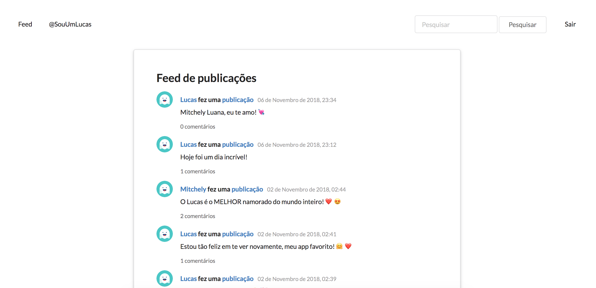
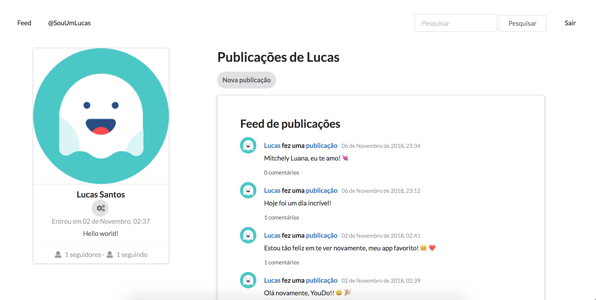
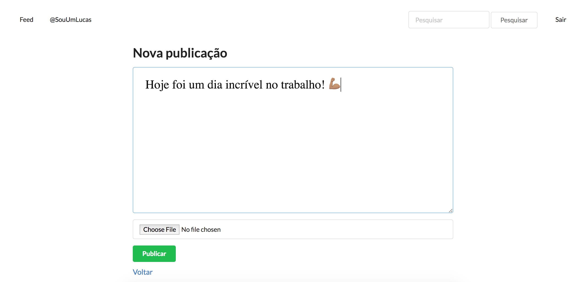
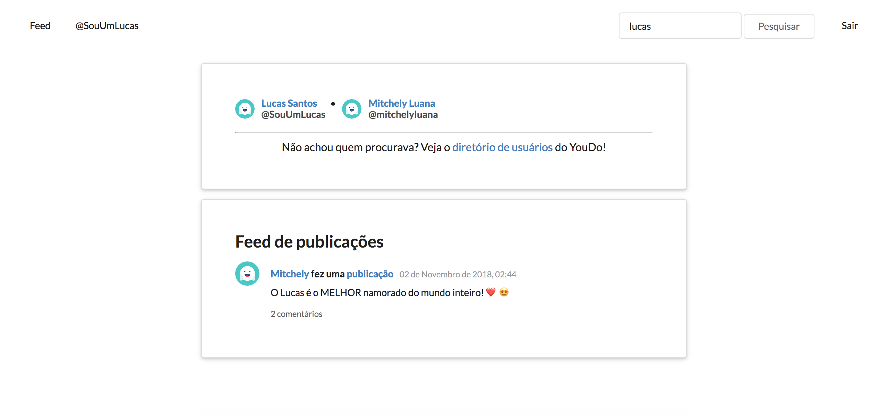

# YouDo Network

Seja bem-vindo(a) a rede social que conecta pessoas baseando-se em seus interesses!

Esse app eu uso para testar coisas novas do Ruby. Então espere por mudanças constantes por aqui. 😉

Aqui vão algumas capturas de tela do projeto...

Há um feed de atualizações das pessoas que você segue:
 <!-- .element height="50%" width="50%" -->

Você também pode ver seu próprio perfil...
 <!-- .element height="50%" width="50%" -->

E fazer uma nova publicação!
 <!-- .element height="50%" width="50%" -->

Pode também pesquisar por outros usuários e posts...
 <!-- .element height="50%" width="50%" -->

E visualizar e deixar comentários em publicações.
 <!-- .element height="50%" width="50%" -->


### Dependências

É necessário ter o Elasticsearch instalado, pois é usado o Searchkick para pesquisa por usuários e posts. Além disso, uma conta na Amazon AWS também é necessária, pois atualmente uso o S3 para upload de imagens

### Setup

```
$ bundle install
$ rails s
```

### Arquitetura

O YouDo em produção utiliza os serviços RDS (com o Postgres), S3 (para upload de imagens) e EC2 (para manter o projeto em execução). O Elasticsearch também é usado para pesquisa avançada por usuários e publicações.